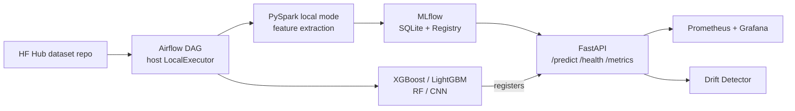

# DA5402W — Audio Classification MLOps Pipeline

End-to-end MLOps pipeline for classifying urban sounds (UrbanSound8K): PySpark feature extraction, four Optuna-tuned models with MLflow tracking, FastAPI serving, host Airflow orchestration, and Prometheus / Grafana / drift monitoring.

Design decisions and rationale: [`docs/DESIGN.md`](docs/DESIGN.md).

## 1. Project overview

UrbanSound8K has 8,732 labeled clips across 10 classes (air conditioner, car horn, children playing, dog bark, drilling, engine idling, gun shot, jackhammer, siren, street music). This repo:

1. Fetches data from [`risan-raja-iitm/urbansound8K`](https://huggingface.co/datasets/risan-raja-iitm/urbansound8K) on Hugging Face Hub (parquet; no Kaggle credentials).
2. Extracts tabular audio features with PySpark UDFs on the host; train/eval splits follow the dataset `fold` column (1–10).
3. Trains and compares four models — XGBoost, LightGBM, Random Forest, and a ResNet-18 CNN on mel-spectrograms — with Optuna and MLflow.
4. Serves the winner via FastAPI (`/health`, `/metrics`, `/predict`) in Docker Compose.
5. Orchestrates ingestion through training with an Airflow DAG on the **host** (LocalExecutor).
6. Monitors the live API with Prometheus, Grafana, JSON prediction logs, and KS/PSI drift detection.

Dataset and model versioning use Hugging Face Hub (same dataset repo for `interim`/`processed`; separate model repo for artifacts). DVC remains a documented secondary path.

## 2. System architecture



**Host vs Compose:** Airflow and PySpark/training run in the project `.venv` on the host (so macOS training can use MPS). Docker Compose runs only the API, MLflow, Prometheus, and Grafana. The Airflow DAG expects Compose MLflow at `http://localhost:5001` — do not point two writers at the same SQLite MLflow file.

| Service | How it runs | Port |
| :--- | :--- | ---: |
| FastAPI | Compose | 8000 |
| MLflow UI | Compose | 5001 |
| Airflow UI | Host (`make airflow`) | 8080 |
| Prometheus | Compose | 9090 |
| Grafana | Compose | 3000 |

## 3. Setup and installation

### Prerequisites

| Tool | Notes |
| :--- | :--- |
| Python 3.13+ | `python3` / `python` on PATH |
| [uv](https://docs.astral.sh/uv/getting-started/installation/) | Lockfile install (`uv.lock`) |
| Java 17+ | Required for PySpark feature extraction |
| Docker + `docker compose` (v2) | API / MLflow / monitoring (not needed for training alone) |
| Hugging Face account | Dataset download and Hub pushes |

### Recommended bootstrap

```bash
git clone https://github.com/risan-raja/DA5402W-MLOps.git
cd DA5402W-MLOps
bash scripts/setup.sh
# or: make setup
```

`scripts/setup.sh` detects the OS, checks Python ≥ 3.13, `uv`, and Java ≥ 17 (fails if missing), warns if Docker or HF auth is absent, runs `uv sync --locked --group dev`, and seeds `.env` from `.env.example` when `.env` is missing. It does **not** auto-install system packages.

### macOS / Linux

```bash
source .venv/bin/activate
```

On macOS, if `java -version` is still below 17 after Homebrew:

```bash
brew install openjdk@17
export JAVA_HOME="$(brew --prefix openjdk@17)"
export PATH="$JAVA_HOME/bin:$PATH"
```

Host training can use Apple MPS when available.

### Windows

**WSL2 (Ubuntu) is strongly preferred** — same commands as Linux after installing Python 3.13+, `uv`, JDK 17, and Docker Desktop’s WSL integration.

Alternatively, run `bash scripts/setup.sh` from **Git Bash**. Activate with:

```bash
source .venv/Scripts/activate
```

Linux and Windows resolve PyTorch from the CPU wheel index in `pyproject.toml` (`pytorch-cpu`); macOS uses the default index (MPS-capable builds when available).

### Manual fallback

```bash
uv sync --locked --group dev
cp .env.example .env   # if .env does not exist yet
```

### Auth

```bash
hf auth login
# or set HF_TOKEN=... in .env
```

## 4. Steps to run pipelines and services

Activate the venv first (`source .venv/bin/activate` or Windows `source .venv/Scripts/activate`).

**Dataset (HF Hub):**

```bash
python -m src.data_pipeline.dataset_downloader --target raw
python -m src.data_pipeline.dataset_downloader --target interim
python -m src.data_pipeline.dataset_downloader --target raw --target interim
```

**Feature extraction (PySpark, host):**

```bash
python -m src.data_pipeline.spark_feature_extractor --force
# optional Hub upload: add --push, or set versioning.push_processed: true in config/config.yaml
```

Splits are fold-based (`fold` 1–10), not a random train/test split.

**Training (MLflow):**

```bash
python -m src.models.train --config config/config.yaml
# optional: --cv  (official 10-fold CV after Optuna)
# optional: --models rf,xgboost,lightgbm,resnet18
```

With Compose up, point tracking at the server (`MLFLOW_TRACKING_URI=http://localhost:5001` in `.env` or via the Airflow wrapper). Host CLI can use `sqlite:///mlflow/mlflow.db` only when the Compose MLflow container is **not** writing the same file.

**Compose + Airflow:**

```bash
make compose    # API :8000, MLflow :5001, Prometheus :9090, Grafana :3000
make airflow    # LocalExecutor UI :8080 (metadata in .airflow/)
```

DAG training expects Compose MLflow at `http://localhost:5001`.

**Versioning (HF; DVC secondary):**

```bash
# Do not re-upload raw. Push interim / processed under the same dataset repo.
python -m src.data_processing.versioning push data/interim interim
python -m src.data_processing.versioning push data/processed processed

python -m src.data_processing.versioning push-models models
python -m src.data_processing.versioning push-winner models
make pull-winner   # winner.json + winner/ into models/

# Documented alternative:
dvc add models/
dvc push
```

**Tests and lint:**

```bash
uv run pytest -q -m "not integration"
uv run ruff check .
```

**Type checking:**

```bash
make typecheck          # pyrefly check (src, tests, airflow/dags)
make type-coverage      # check + coverage report + ≥95% gate
# or: bash scripts/verify_type_coverage.sh
```

## 5. API usage

With Compose running, the API is at `http://localhost:8000`:

```bash
curl http://localhost:8000/health

curl -X POST http://localhost:8000/predict \
  -F "file=@data/sample_audio/dog_bark_sample.wav"

make demo-predict
# more load for Grafana: python -m src.deployment.demo --repeat 4

curl http://localhost:8000/metrics

make drift-reference
make drift-score
```

`/predict` returns class, confidence, `model_name`, `latency_ms`, and a 10-class `probabilities` map. Bad uploads return structured errors. If no winner is loaded, `/predict` is 503 while `/health` stays 200.

Grafana: [http://localhost:3000](http://localhost:3000) — credentials from `.env` (`GF_SECURITY_ADMIN_USER` / `GF_SECURITY_ADMIN_PASSWORD`, defaults `admin` / `admin`). Open the provisioned **API Overview** dashboard.

## 6. Docker execution

Use Compose **v2** (`docker compose`, not the legacy `docker-compose` binary):

```bash
make compose
# equivalent:
# docker compose --env-file .env -f docker/docker-compose.yml up --build -d

docker compose --env-file .env -f docker/docker-compose.yml ps
docker compose --env-file .env -f docker/docker-compose.yml logs -f api

make compose-down
# equivalent:
# docker compose --env-file .env -f docker/docker-compose.yml down
```

Airflow is **not** in Compose — use `make airflow` on the host.

Ports: API `8000`, MLflow `5001`, Airflow `8080`, Prometheus `9090`, Grafana `3000`.

## 7. Folder structure and dependencies

```
DA5402W/
├── .github/workflows/   # CI: ruff, pytest, Docker build
├── airflow/dags/        # Host Airflow DAG
├── config/              # config.yaml, logging.yaml
├── data/                # raw/, interim/, processed/, sample_audio/
├── docker/              # Dockerfile.api, docker-compose.yml, prometheus/, grafana/
├── docs/                # DESIGN.md, course brief
├── models/              # Trained artifacts / winner (gitignored binaries)
├── report/              # LaTeX technical report
├── scripts/             # setup.sh, run_airflow.sh, …
├── src/
│   ├── data_pipeline/       # download, PySpark features
│   ├── data_processing/     # clean/augment, HF versioning
│   ├── models/              # train / evaluate / Optuna
│   ├── deployment/          # FastAPI app
│   └── monitoring/          # logs + drift
├── tests/
├── .env.example
├── Makefile
├── pyproject.toml
├── uv.lock
└── README.md
```

Runtime and optional dependency groups are declared in [`pyproject.toml`](pyproject.toml); install from the lockfile with `uv sync --locked --group dev` (same as CI and `scripts/setup.sh`).
